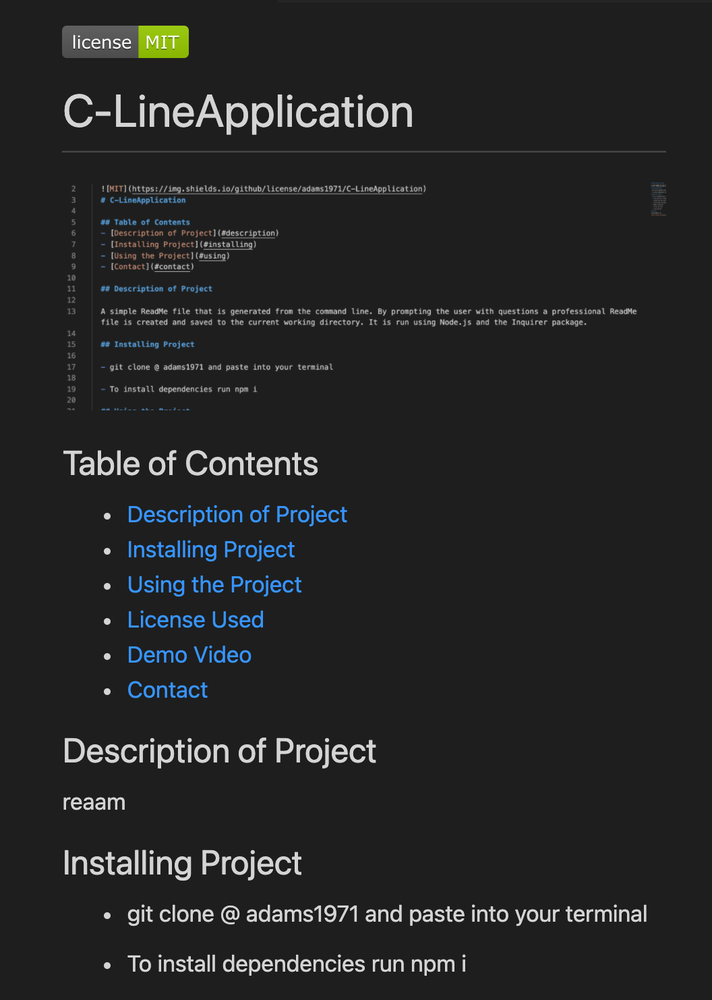
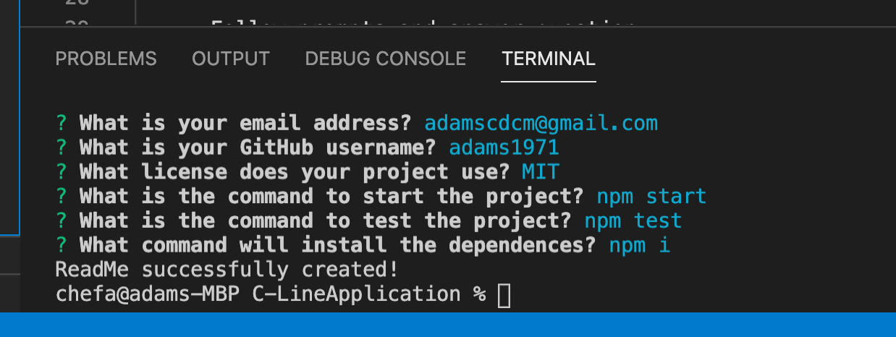

  
  # C-LineApplication

  

  ## Table of Contents
  - [Description of Project](#description-of-project)
  - [Installing Project](#installing-project)
  - [Using the Project](#using-the-project)
  - [Demo Video](#demo-video)
  - [Contact](#contact)

  ## Description of Project
  
  A simple ReadMe file that is generated from the command line. By prompting the user with questions a professional ReadMe file is created and saved to the current working directory. It is run using Node.js and the Inquirer package.

  ## Installing Project

  - git clone @ adams1971 and paste into your terminal

  - To install dependencies run npm i

  ## Using the Project
  
  - To use C-LineApplication, follow these steps;

  - - To Run open file in VSCode and open Intergrated Terminal
  
  - - To Begin type node index.js 

  - - Follow prompts and answer question
  
  - - ReadMe is generated 

  - - To start npm start
  
  - - To test npm test

  

  ## Demo Video
  https://drive.google.com/file/d/1Ma75LxHBJu-EkrY2WSKzjhZHMUn-xieR/view?usp=sharing

  ## Contact

  adamscdcm@gmail.com

  [https://github.com/adams1971](https://github.com/adams1971)